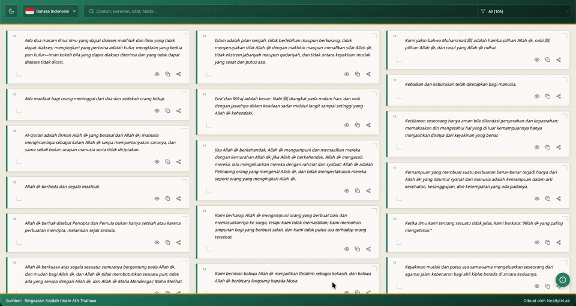
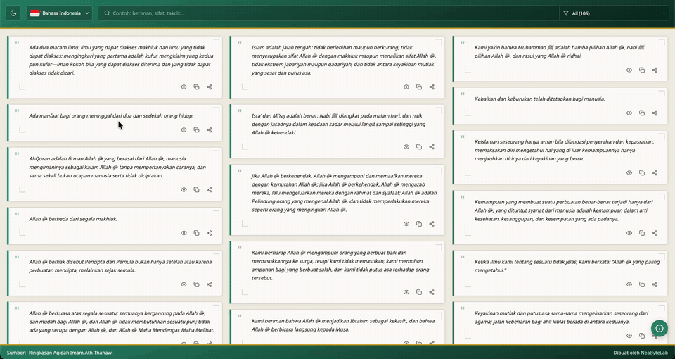
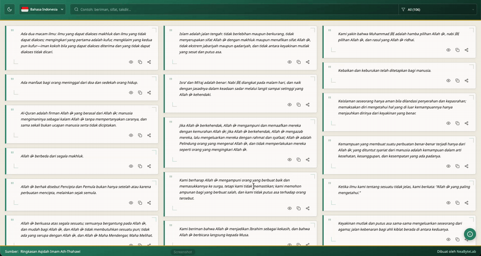

# Alaqidah [](https://github.com/NeaByteLab/Alaqidah/actions/workflows/deploy.yml) [](LICENSE)

A small app to browse the Aqidah of Imam Tahawi (Aqidah Tahawiyyah) in 21 languages. Search, filter by category, dark/light theme, share image. English from alaqida.com; the rest by the author. Hope it helps you.

<div align="center">

|                Quote search                 |                  Filter by category                  |
| :-----------------------------------------: | :--------------------------------------------------: |
|  |  |
|                Theme change                 |                   Preview & share                    |
|  |     |

</div>

## Features

- **Multi-language:** Twenty-one locales from Arabic through Chinese for content and UI.
- **Accessibility:** ARIA labels, Escape to close modals, and semantic HTML.
- **Categories:** Filter quote points by category such as Tawhid and Revelation.
- **Search:** Full-text search over quote content with highlighted match results.
- **Theme:** Dark and light mode with system preference detection and persistence.
- **Preview:** Modal shows full quote, explanation, and category label.
- **Share:** Copy to clipboard or export as PNG (quote only or quote + explanation).
- **PWA:** Installable app with offline support provided via service worker.
- **i18n:** UI strings and quote content per language in JSON files.

## Tech stack

| Layer    | Technology                                           | Role                                                    |
| -------- | ---------------------------------------------------- | ------------------------------------------------------- |
| Runtime  | [Deno](https://deno.com/)                            | Script runner, dependency resolution, lint/format/check |
| Routing  | [React Router](https://reactrouter.com/) 7           | Client-side routes (`/:lang`)                           |
| Frontend | [React](https://react.dev/) 19                       | Components, state, lazy loading                         |
| Build    | [Vite](https://vite.dev/)                            | Dev server, HMR, production bundling                    |
| PWA      | [vite-plugin-pwa](https://vite-pwa-org.netlify.app/) | Service worker, offline, auto-update                    |

## Installation

**[→ Live demo](https://app-alaqidah.neabyte.com/)** · or run locally:

Clone the repository, then run the dev server. Deno will resolve dependencies on first run.

```bash
git clone https://github.com/NeaByteLab/Alaqidah
cd Alaqidah
deno task dev
```

Open [http://localhost:5173](http://localhost:5173) (or the URL shown in the terminal).

## Scripts

| Task    | Command             | Description                                 |
| ------- | ------------------- | ------------------------------------------- |
| Dev     | `deno task dev`     | Start Vite dev server with HMR              |
| Build   | `deno task build`   | Production build (output in `dist/`)        |
| Preview | `deno task preview` | Serve the production build locally          |
| Prod    | `deno task prod`    | Build then preview (alias for deploy check) |
| Check   | `deno task check`   | Format, lint, and type-check `src/`         |
| Test    | `deno task test`    | Format, lint, and run tests in `tests/`     |

Before opening a PR, run `deno task check` and fix any format/lint/type errors.

## Project structure

```
Alaqidah/
├── index.html               # Entry HTML, mounts Main.tsx
├── deno.json                # Deno config, tasks, imports
├── vite.config.ts           # Vite + React + PWA plugin
├── public/
│   ├── favicon.ico
│   └── manifest.webmanifest
└── src/
    ├── Types.ts             # LangCode, QuoteEntry, I18nEntry, ThemeMode
    ├── Content/             # Quote data per language
    │   ├── index.ts         # Loads JSON, exports quotes, getQuoteDetail, getCategoryList
    │   └── <lang>.json      # 21 files (ar, en, id, zh, etc.)
    ├── Translation/         # UI strings per language
    │   ├── index.ts         # translationsByLang, langList
    │   └── <lang>.json      # 21 files (ar, en, id, zh, etc.)
    ├── Utils/               # Lang, Storage, Theme
    ├── Views/               # React components
    │   ├── Main.tsx         # App entry, router, lazy routes
    │   ├── App.tsx          # Main layout, state, quote grid
    │   ├── Header.tsx       # Theme, language, search, category
    │   ├── Footer.tsx       # Source link, credit
    │   ├── Preview.tsx      # Quote detail modal
    │   ├── Share.tsx        # Share modal, canvas export PNG
    │   ├── Errors/          # 404, 500, ErrorBoundary
    │   └── ...
    └── Assets/
        └── style.css        # Global styles, theme variables
```

## Contributing

Contributions are welcome. The most valuable help is fixing translations and language JSON so the app is accurate and readable in every locale. Fork, edit the JSON files, run deno task check, then open PR. Thanks

### Where to edit

1. **Quote content (per language)**
   - **Path:** `src/Content/<lang>.json`
   - **Shape:** Array of `{ "no", "title", "text", "explanation", "category" }`.
   - Use `src/Content/en.json` as the reference. Fix wrong wording, typos, or missing/incorrect explanations for a given language.

2. **UI strings (per language)**
   - **Path:** `src/Translation/<lang>.json`
   - **Shape:** Single object with keys such as `aboutTitle`, `aboutBody`, `placeholder`, `noResults`, `shareSaveAsImage`, etc.
   - Use `src/Translation/en.json` for the full list of keys. Fix wrong or unnatural UI translations.

### How to contribute

1. Fork the repo and create a branch (e.g. `fix/translation-id` or `fix/ja-ui-strings`).
2. Edit only the relevant JSON file(s); keep the same structure and keys.
3. Run `deno task check` (no code changes needed for translation-only edits, but good to confirm nothing is broken).
4. Open a PR with a short description of what you fixed (e.g. “Corrected Indonesian quote #5 explanation” or “Fixed Japanese UI labels for share modal”).

Adding a **new language** requires code changes (`src/Types.ts` `LangCode`, `src/Content/index.ts`, `src/Translation/index.ts`, and new JSON files); open an issue first to align on the approach.

## License

This project is licensed under the MIT license. See the [LICENSE](LICENSE) file for more info.
